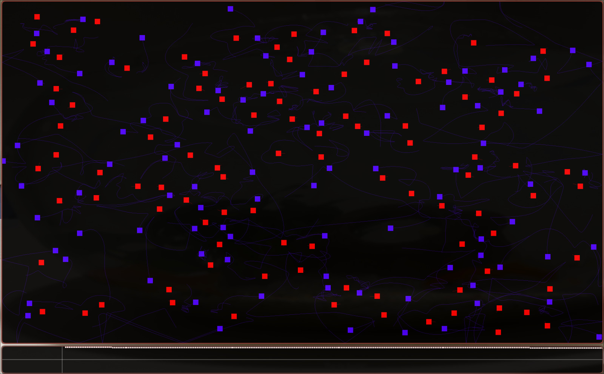
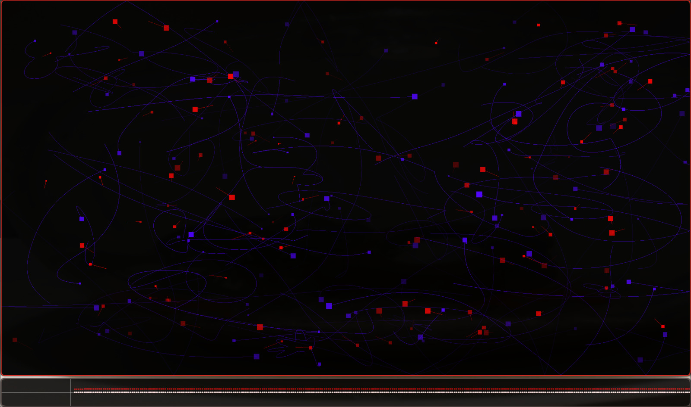

# Many Corp Simulation
I wrote this project to simulate the motion of n bodies (where n is an arbitrary number) following classical laws of motion in an electromagnetic field. I'm attaching a couple of screenshots:


---


## Dependencies and project usage
The project is written entirely in C and requires the `make` and `gcc` software. It also uses the OpenGL library `<GLFW/glfw3.h>`. This can be downloaded either from the official repositories (on Linux) or from the website: https://www.glfw.org/download.html

---
Once the files are been downloaded, you need to enter the folder `Many-corp-simulation/` and start the compilation with the command:  

```bash
make
```

This will create a `sim` executable file (as well as object files in the `build/` folder). Then you have to run it from terminal with the command (on linux):
```bash
./sim (parameter)
```
This will create two windows in which you can view the simulation.
The parameter you can include in the command represents the solution method used for the equations of motion:
- 1 => **Euler method**-------`./sim 1`
- 2 => **Verlet Velocity**-----`./sim 2`
- 3 => **Runge Kutta 4**------`./sim 3`
- 4 => **Runge Kutta 45**-----`./sim 4`

Another available command is: 
```bash 
make clean
```
which deletes all object files from `build/`
## Configuration
The `config.txt` file is used to configure the simulation parameters. By default, it contains the following data:
```text
e=100           # Number of electron
pr=100          # Number of proton
A=10            # How many angstroms long is half the simulation?
C=-11.1         # Collision potential effectiveness
ut=5e-7         # Simulation time unit
```
The first two values ​​(number of electrons and protons) can be modified at will (within a limit otherwise, it explodes). I recommend leaving the other parameters as they are, but obviously, you can do whatever you like. (Pay attention to the effectiveness parameter, which is negative by default; to increase it, you need to change -11.1 -> -10.1)

Once you have modified the `config.txt` file, you must save it and recompile the entire project.

Another variable that can be modified is the **number of dimensions**; to change it, you must modify the 5th line of the `head/simlib_struct.h` file (It is set to `DIM=2` by default):
```c
#define DIM 2
```
the permitted values ​​are `DIM=[2,3,4]`, the third dimension is represented by the size of the particles, while the fourth is represented by the opacity of their color.

## Project composition
The project is divided into the following folders:
- `prg/` ----| The main program is located here:
    - `sim.c`
- `lib/` ----| The libraries are located here: 
    - `simlib.c` --------------*initialization of variables and calculation of recurring quantities*
    - `simlib_metodi.c` -----*the four methods of resolution*
    - `simlib_base.c` -------*useful mathematical functions*
- `head/` ---| The header files are located here:
    - `simlib_struct.h` ----*structures used*
    - `simlib.h`
    - `simlib_metodi.h`
    - `simlib_base.h`
- `build/` --| The Makefile is located here, and the compilation results will end up here.
- `doc/` -----| Here are the files useful for the README.md.